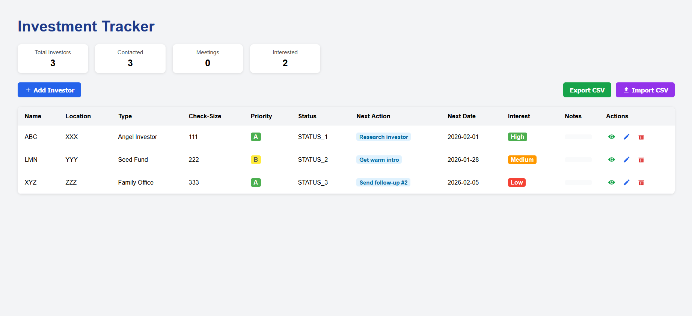
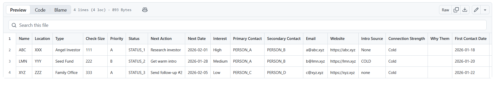
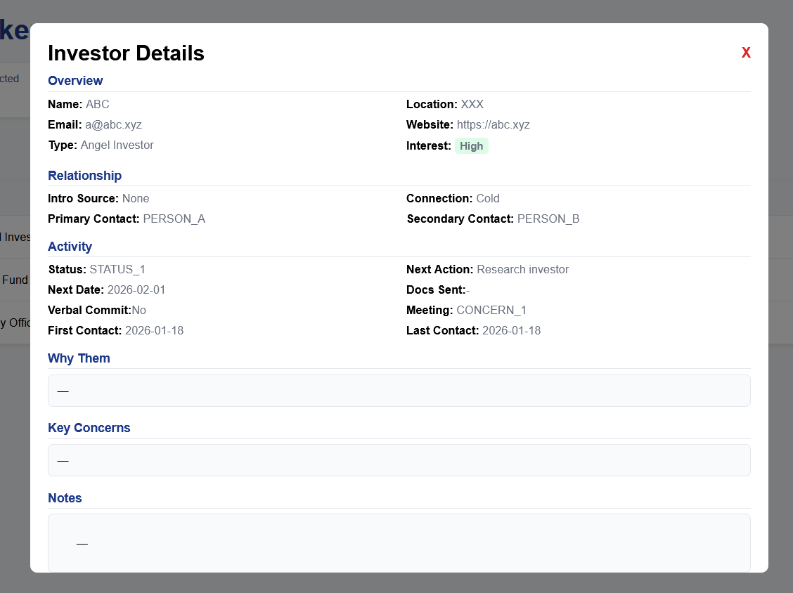
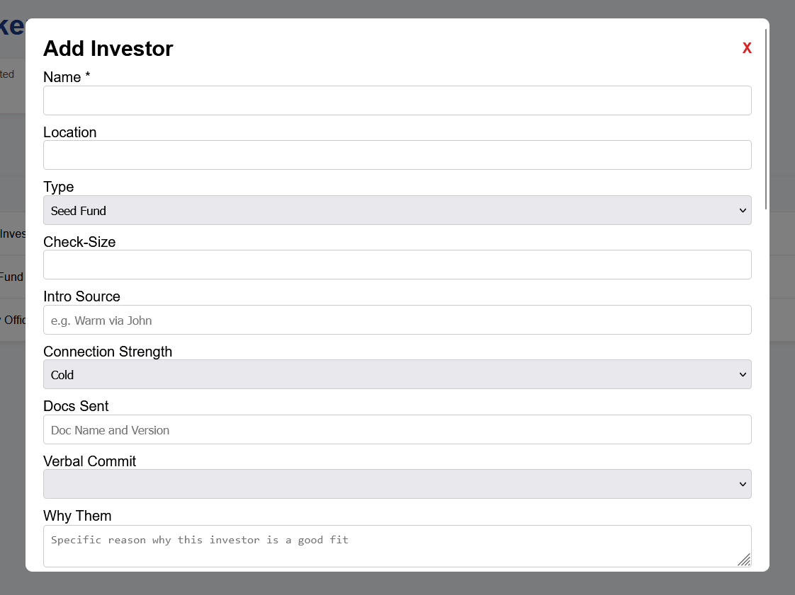
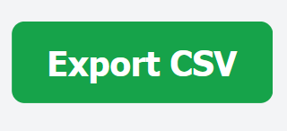

# 🚀 Investor Tracker



**Lightweight Investor CRM for Founders** - Track outreach, manage follow-ups, zero setup required.

[](https://jd32bit.github.io/investor-tracker/)
[](LICENSE)
[](https://developer.mozilla.org/en-US/docs/Web/HTML)

A simple, powerful HTML-based investor tracking tool designed for early-stage founders who need to manage investor relationships without the complexity of enterprise CRM systems.

---

## ✨ Why Investor Tracker?

- **🎯 Zero Setup** - Open the HTML file and start tracking immediately
- **💾 Your Data Stays Yours** - Completely client-side, no server or database required
- **📊 Import/Export** - Work with CSV files for backups and bulk updates
- **🚫 No Subscription Fees** - Free and open-source forever
- **⚡ Lightning Fast** - No loading times, no internet connection needed

Perfect for founders in the early stages of fundraising who need a simple way to stay organized.

---

## 🎬 Quick Start

1. **Download and Open**
   ```bash
   # Clone the repository
   git clone https://github.com/JD32bit/investor-tracker.git
   
   # Open in your browser
   open InvestorTracker.html
   ```
   Or simply download `InvestorTracker.html` and double-click to open.

2. **Optional: Import Sample Data**
   - Click 
   - Select `dummy_csv.csv` to test with sample data
   - Start managing your investor pipeline!

---

## 🎯 Features

### Core Functionality
- ➕ **Add Investors** - Capture name, location, type, check size, and status
- ✏️ **Update Records** - Keep information current as relationships evolve
- 🗑️ **Remove Entries** - Clean up your pipeline easily
- 📥 **CSV Import** - Bulk import investor data
- 📤 **CSV Export** - Backup your data or share with co-founders
- 📝 **Notes & Follow-ups** - Track key conversations and next steps

### Track What Matters
- Investor name and firm
- Geographic location
- Investor type (Angel, VC, Corporate, etc.)
- Typical check size
- Current status (Researching, Reached Out, Meeting Scheduled, etc.)
- Custom notes and follow-up reminders

---

## 📖 How to Use

### View Investor Details


Click  to open a detailed view with notes, contact history, and quick actions.

---

### Add New Investors

1. Click the **Add Investor** button: 

2. Fill in the investor details:
   

3. Click **Save** to add them to your pipeline

---

### Update Investor Information

1. Click  next to any investor
2. Modify the fields as needed
3. Click **Save** to update

---

### Remove Investors

Click  and confirm when you want to remove an investor from your list.

---

### Export Your Data

Click  to download your complete investor list as a CSV file.

**Note:** Files save to your browser's default Downloads folder.

---

## 📋 CSV Format

Your CSV should include these columns:

```
Name, Firm, Location, Type, Check Size, Status, Last Contact, Next Steps, Notes
```

**Example:**
```csv
Jane Smith,Acme Ventures,San Francisco,VC,$500K-$1M,Meeting Scheduled,2024-01-15,Send deck,Met at TechCrunch
```

Use `dummy_csv.csv` as a reference template.

---

## 🔒 Privacy & Data Security

- ✅ **100% Client-Side** - Your data never leaves your computer
- ✅ **No Tracking** - No analytics, no cookies, no data collection
- ✅ **No Account Required** - No sign-ups, no passwords to remember
- ⚠️ **Important:** Do not commit real investor data to public repositories

### Best Practices
- Keep CSV exports in a secure, local location
- Use placeholder data for testing and screenshots
- Consider encrypting sensitive investor information
- Back up your data regularly using the CSV export

---

## 🛠️ Technical Details

**Built With:**
- Pure HTML5, CSS3, and JavaScript
- No frameworks, no dependencies
- Works in all modern browsers
- Responsive design for mobile and desktop

**Browser Support:**
- Chrome/Edge (latest)
- Firefox (latest)
- Safari (latest)

---

## 🤝 Contributing

Contributions are welcome! Whether it's:
- 🐛 Bug reports
- 💡 Feature suggestions
- 📝 Documentation improvements
- 🔧 Code contributions

Please feel free to open an issue or submit a pull request.

---

## 📝 License

This project is licensed under the [MIT License](LICENSE) - feel free to use it for personal or commercial projects.

---

## 🌟 Show Your Support

If this tool helps you manage your fundraising process, give it a ⭐️ on GitHub!

---

## 💬 Questions or Feedback?

Open an issue on GitHub or reach out - I'd love to hear how you're using Investor Tracker!

---

**Made with ❤️ for founders navigating the fundraising journey**
